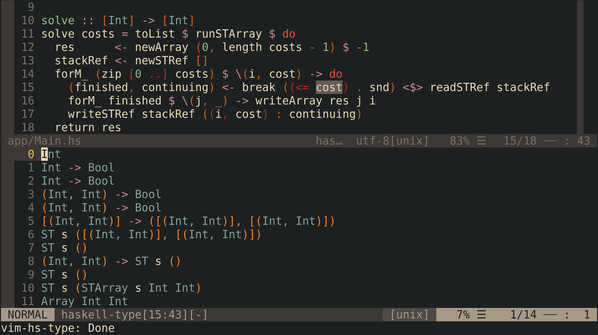
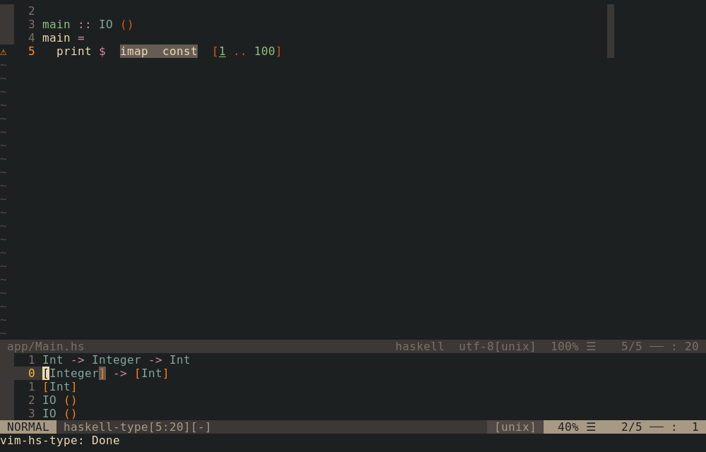
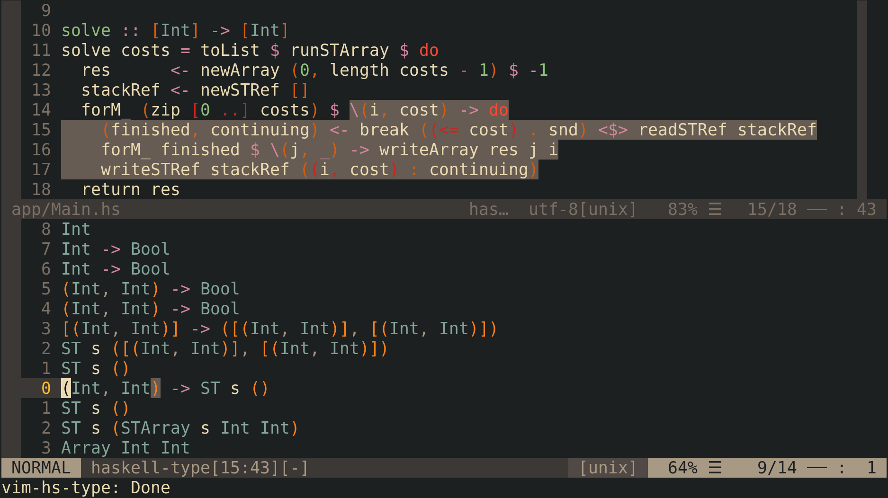

vim-hs-type
===========
This plugin has started as a fork of [vim-hdevtools]. It aims to improve getting type information ignoring every other abilities of [hdevtools], cause they are better done by [haskell-ide-engine].

## Why is it better than [vim-hdevtools]?
1. **Interacting with types.** Opened window contains types as a plain text, so you can interact with them as with a plain text.
2. **Multiple projects support.** While [vim-hdevtools] stops only first started [hdevtools] server, `vim-hs-type` stops them all, even if they are in different projects and directories.
3. **Interacting with expressions.** `vim-hs-type` supports `ie` and `ae` text objects (see [Usage](#Usage)).
4. **More clean and readable code.** Finally I've rewritten almost all the code. That's why this plugin is now split from the [vim-hdevtools]'s forks tree.
5. **More customisation abilities.** See [Configuration](#Configuration).

## Installation
First of all you have to install [hdevtools], if you didn't do this yet.

You can do it via [stack] from Stackage:
```shell
$ stack install hdevtools
```

or via [cabal] from Hackage:
```shell
$ cabal install hdevtools
```

Then use your favourite plugin manager to install `vim-hs-type` into Vim. For [vim-plug]:
```vim
Plug 'fimmind/vim-hs-type'
```

## Usage
Main function of this plugin is `vim_hs_type#type()`. When you run it, a window containing all types of expressions under cursor is opened (You can close it with `<Esc>` or `gq`). Most likely in your case this won't look exactly the same, cause I have many other plugins installed, but for my setup it looks this way:



Moving cursor over lines causes highlighting of relevant expression in source code:




Also, text object of highlighted expression is available by `ie` and `ae` (latter also selects space around expression similarly to `aw`), but sadly they work only in visual mode, so you can't, for example, use `dae` to delete an expression (while `vaed` works fine).

## Configuration
This plugin is configured via `g:vim_hs_type_conf` dictionary with such keys:

| key                      | description                                                 | default        |
|--------------------------|-------------------------------------------------------------|----------------|
| `'max_height'`           | Maximal height of opened window                             | `12`           |
| `'dynamic_height'`       | Enable/Disable dinamic height                               | `1`            |
| `'path_to_hdevtools'`    | Path to `hdevtools` executable                              | `'hdevtools'`  |
| `'hdevtools_args'`       | Arguments passed to `hdevtools`                             | `[]`           |
| `'expression_obj'`       | Letter or string for expression object                      | `'e'`          |
| `'highlight_group'`      | Highlighting group for expressions in source code           | `'MatchParen'` |
| `'hdevtools_from_stack'` | If enabled, hdevtools runs from a stack's hdevtools package | `0`            |

So, if you, for example, want to disable dynamic height and stack integration and highlight expressions in source code with `Visual` group, add following to your `vimrc`:
```vim
let g:vim_hs_type_conf = {
      \ 'dynamic_height': 0,
      \ 'hdevtools_args': ['--nostack'],
      \ 'highlight_group': 'Visual'
      \ }
```

## LICENSE
* MIT

[vim-hdevtools]:      https://github.com/bitc/vim-hdevtools
[vim-plug]:           https://github.com/junegunn/vim-plug
[neovim]:             https://neovim.io/
[hdevtools]:          https://github.com/hdevtools/hdevtools
[haskell-ide-engine]: https://github.com/haskell/haskell-ide-engine
[stack]:              http://haskellstack.org
[cabal]:              https://www.haskell.org/cabal/
