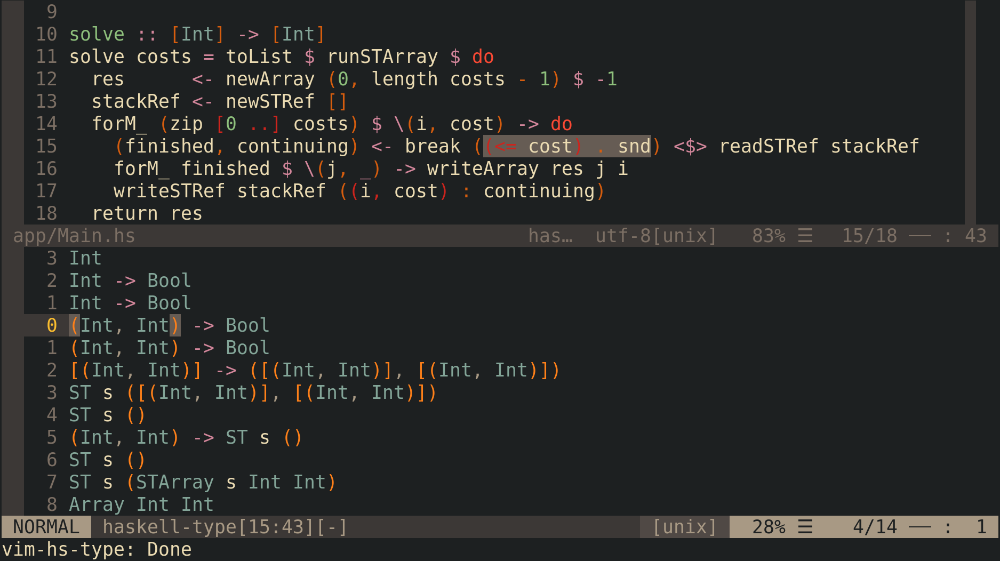

vim-hs-type
===========

This plugin started as a fork of [vim-hdevtools] and is now still in development. It aims to improve getting type information ignoring every other abilities of [hdevtools], cause they all are better done by [haskell-ide-engine].

## Why is it better than [vim-hdevtools]?
TODO

## Installation

First of all you have to install [hdevtools], if you didn't do this yet.

You can do it via [stack] from Stackage:
```shell
$ stack install hdevtools
```

or via [cabal] from Hackage:
```shell
$ cabal install hdevtools
```

Then you can use your favourite plugin manager to install `vim-hs-type` into Vim. I prefer [vim-plug], so in my case I add this to my `vimrc` (`init.vim` actually, cause I use [Neovim]):
```
Plug 'fimmind/vim-hs-type'
```
then restart Vim and run `:PlugInstall`.

## Usage

This plugin exports function `vim_hs_type#type()`, which does all the work. When you run it, a window, containing all types of expressions under cursor, is opened (You can leave it with `<Esc>` or `:q`). Most likely in your case this won't look exactly the same, cause I have many other plugins installed, but for my setup it looks this way:


And a greatest feature of this plugin. Moving cursor over lines causes highlighting of relevant expression in source code:




Also, text object of highlighted expression are available by `ie` and `ae` (latter also selects space around expression similarly to `aw`), but sadly they work only in visual mode, so you can't, for example, use `dae` to delete an expression, but `vaed` works fine.

## Configuration
TODO

## LICENSE

Copyright (c) 2020 Vinogrodskiy Serafim

For full information see LICENSE.

[vim-hdevtools]:      https://github.com/bitc/vim-hdevtools
[vim-plug]:           https://github.com/junegunn/vim-plug
[neovim]:             https://neovim.io/
[hdevtools]:          https://github.com/hdevtools/hdevtools
[haskell-ide-engine]: https://github.com/haskell/haskell-ide-engine
[stack]:              http://haskellstack.org
[cabal]:              https://www.haskell.org/cabal/
